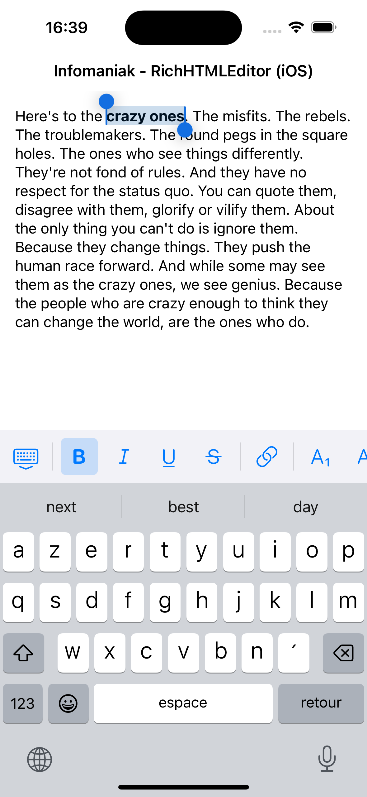

# Infomaniak Rich HTML Editor

[](https://swiftpackageindex.com/Infomaniak/swift-rich-html-editor)
[](https://swiftpackageindex.com/Infomaniak/swift-rich-html-editor)

The **Infomaniak Rich HTML Editor** is a powerful Swift package designed to provide a seamless WYSIWYG (What You See Is What You Get) text editing experience across iOS, macOS, and visionOS platforms. Leveraging the power of the `contenteditable` HTML attribute, this editor allows you to effortlessly edit HTML content.

Built with **UIKit** and **AppKit** thanks to WebKit, it also includes a **SwiftUI** port, making it easy to integrate into modern Swift apps.

<table>
    <tr>
        <td>
            
        </td>
        <td>
            
        </td>
        <td>
            
        </td>
    </tr>
</table>

Looking for an Android equivalent? Check out the Kotlin version of the editor here: [Infomaniak/android-rich-html-editor](https://github.com/Infomaniak/android-rich-html-editor)

## ✍️ About

### Features

- **HTML Content Editing**: Full support for viewing and editing HTML content directly.
- **Wide range of commands**: Many commands are available to format text, from simple commands like bold to more advanced ones like link creation.
- **Cross-Platform Support:** Compatible with iOS, macOS, and visionOS.
- **SwiftUI API**: A dedicated port for SwiftUI, ensuring modern and declarative UI design compatibility.

### Installation

You can install the package via Swift Package Manager. Add the following line to your Package.swift file:
```swift
.package(url: "https://github.com/Infomaniak/swift-rich-html-editor.git", from: "1.0.0")
```

### Usage

#### UIKit and AppKit

You can create the editor view and then add it to the view hierarchy.
```swift
import InfomaniakRichHTMLEditor
import UIKit

let editor = RichHTMLEditorView()
view.addSubview(editor)
```

To respond to editor's events, you can conform to `RichHTMLEditorViewDelegate`.

#### SwiftUI

The SwiftUI view is called `RichHTMLEditor` and takes two arguments:
- `html: Binding<String>` the HTML content of the editor
- `textAttributes: TextAttributes` the objects that contains the current state selected text (or the text at the insertion point) and is responsible to update the style

```swift
import InfomaniakRichHTMLEditor
import SwiftUI

struct ContentView: View {
    @State private var html = ""
    @StateObject private var textAttributes = TextAttributes()

    var body: some View {
        RichHTMLEditor(html: $html, textAttributes: textAttributes)
    }
}
```

The object `TextAttributes` contains various attributes about the current style of the selected text. Theses properties are read-only and are automatically updated by the editor.
To update the style, you should call the corresponding functions such as `bold()`.

Many modifiers are available to customize the editor and respond to editor's events.
Here is a non-exhaustive list of modifiers:
```swift
RichHTMLEditor(html: $html, textAttributes: textAttributes)
    .editorScrollable(true)
    .editorInputAccessoryView(myToolbarView)
    .editorCSS("h1 { foreground-color: red; }")
    .onEditorLoaded {
        // Perform action when editor is loaded
    }
    .onCaretPositionChange { newPosition in
        // Perform action when caret moves
    }
    .onJavaScriptFunctionFail { error, function in
        // Perform action when an editor JavaScript function has failed
    }
    .introspectEditor { richEditorView in
        // Perform action on the editor (UI|NS)View
    }
```

### Customize the editor

You can customize the editor with CSS.
To target the editor, you should use the `#swift-rich-html-editor` selector.

For example:
```css
#swift-rich-html-editor {
    padding: 16px;
}
```

## 📖 Documentation

Public types are documented, and three sample projects are available to help you implement the editor.

## 🔍 Sample Projects

You can find 3 sample projects in the [Examples](Examples) folder:
- A [project built with UIKit](Examples/Example%20iOS/) for iOS
- A [project built with AppKit](Examples/Example%20macOS/) for macOS
- A [project built with SwiftUI](Examples/Example%20SwiftUI/) for iOS/macOS/visionOS

## 📱 Apps using InfomaniakRichHTMLEditor

<a href="https://github.com/Infomaniak/ios-kMail">
    
</a>

[Infomaniak Mail](https://github.com/Infomaniak/ios-kMail) allows you to manage your Infomaniak addresses in a completely secure environment.
